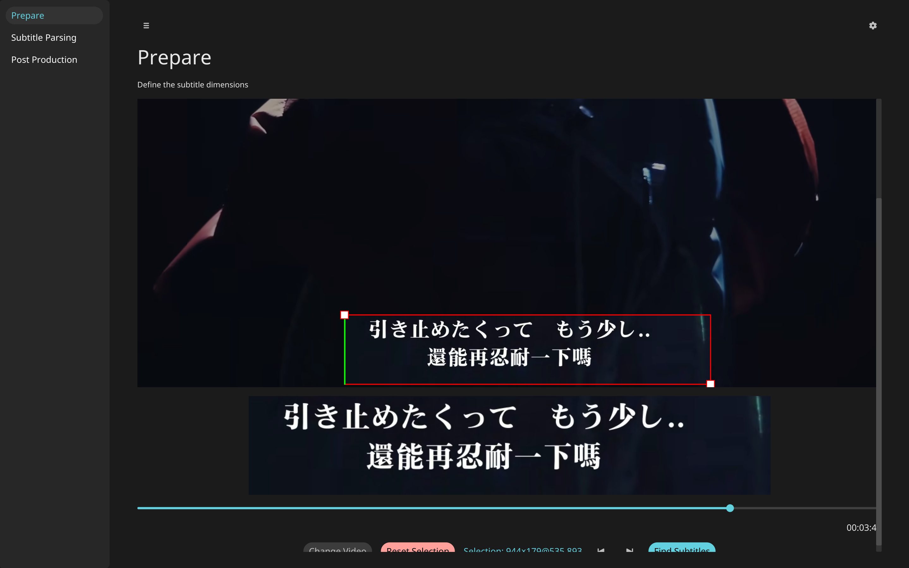
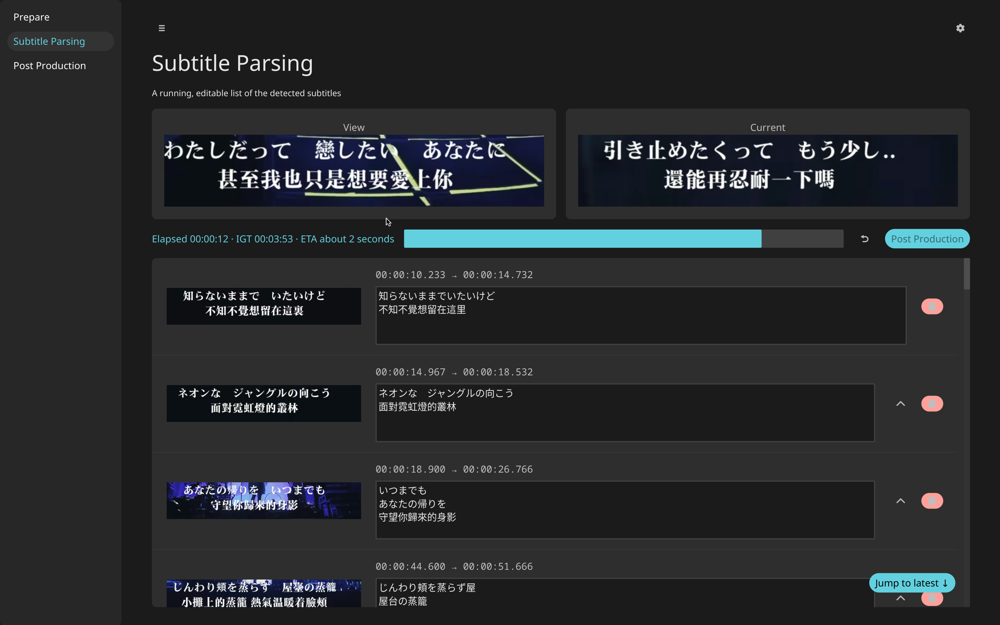
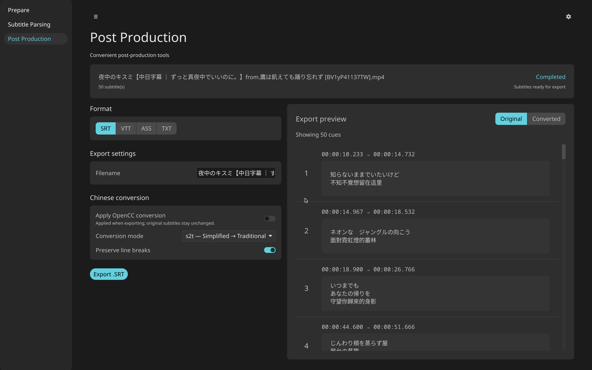

# VideoSubExtract

VideoSubExtract turns hard-coded video subtitles into editable SRT files. It provides a graphical workflow for selecting the subtitle region, detecting subtitle changes, running OCR, correcting the results, and exporting them.

## Features

- Video seeking and a visual region picker, with keyboard adjustment of selection edges.
- Live subtitle results with editing, merge, preview, and undo support.
- Selectable built-in OCR models and dynamically loaded OCR plugins(WIP)
- SRT exporting support.
- OpenCC conversion in the export preview.
- English and Traditional Chinese interfaces, localized with Fluent.
- A command-line extraction mode for scripted use.







## Development status

The application is under active development and currently targets Linux. There are no packaged releases yet; building requires several native libraries and local checkouts described below.

The default detector uses the original VideoSubFinder C++ algorithm. The alternative Rust detector is an early experiment with known correctness and performance problems and is not recommended for normal use.

## Architecture and history

The GUI was originally built with libcosmic. It is being migrated to an [Iced `0.15.0-dev` fork](https://github.com/JustSimplyKyle/iced/tree/dioxus-hot-reload) so it can use upstream Iced APIs while retaining the project's COSMIC-inspired interface. Reusable presentation components and styling live in the `vse-ui` workspace crate. `cosmic-config` and `cosmic-theme` are still used directly.

Development hot-patching comes from the project's Iced fork: its `hot` feature integrates the Dioxus devtools protocol, while `dioxus-cli` runs the development build. The `just dev` and `just dev-release` recipes invoke `dx serve`; Cargo's older hot-reload command is not used.

Video decoding is implemented in Rust with FFmpeg through `ffmpeg-the-third`. The decoder currently does not configure hardware acceleration. Frames are passed across a C ABI to a headless adapter in the VideoSubFinder submodule, which calls the original `FastSearchSubtitles` implementation. The headless native target does not depend on wxWidgets; a small internal shim supplies the legacy types it needs. It links against OpenCV and oneTBB.

OCR is separate from subtitle detection. The detected regions are processed by `ocr-rs` or a compatible dynamic-library plugin, then presented for correction and post-processing before export.

## Building

The Nix development shell documents and supplies the native toolchain. The repository currently expects these sibling/local sources:

```text
../iced-dioxus       # Iced 0.15.0-dev fork, branch dioxus-hot-reload
../libcosmic         # cosmic-config and cosmic-theme
vendor/cosmic-text  # local cosmic-text patch
```

Clone the VideoSubFinder submodule, enter the development shell, and run the application:

```sh
git submodule update --init --recursive
nix develop
just dev
```

Use `just dev-release` for a release-mode hot-patched build or `just release` for a regular release build.

The CLI accepts a video and writes an SRT beside it by default:

```sh
cargo run --release -- video.mkv
cargo run --release -- video.mkv --output subtitles.srt --crop 1920x280@0,800
```

## Contributing

Keep extraction logic independent of the GUI where practical. In UI code, `.apply()` is used to keep builder expressions shallow, and Iced's component API is preferred for reusable controls that own local state. Add user-visible strings to the Fluent files under `i18n/`.

Please treat the Rust subtitle detector as experimental and compare changes against the default C++ detector with representative videos.

## License

VideoSubExtract is licensed under the Mozilla Public License 2.0. The VideoSubFinder submodule and other dependencies retain their own licenses.
